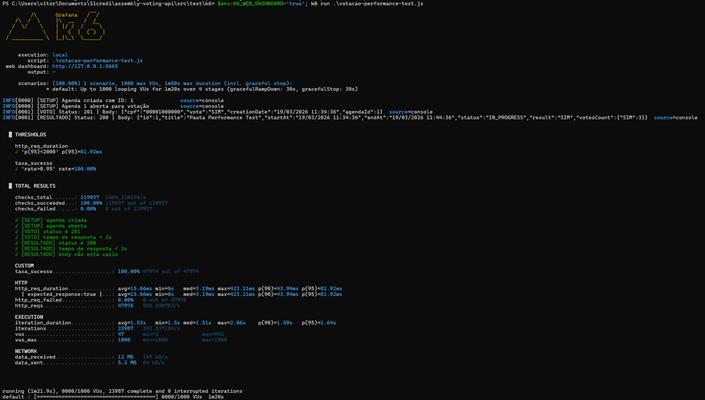

# 🗳️ Assembly Voting API

## 📋 Sobre o Projeto
Esta API foi desenvolvida para gerenciar pautas e votos em um sistema de votação. Ela permite criar pautas, abrir sessões de votação, registrar votos e consultar resultados. O projeto foi implementado utilizando Java 22 e Spring Boot, seguindo as melhores práticas de desenvolvimento e arquitetura de software.

## 🚀 Principais Tecnologias
- Java 22
- Spring Boot 3.4.5
- Maven
- H2 Database
- Swagger/OpenAPI
- JUnit

## ⚙️ Como Executar
A aplicação iniciará na porta localhost:8080. Em desenvolvimento foi utilizado o Application do IntelliJ, mas também é possível executar via terminal:
```bash
mvn spring-boot:run
```

## 📌 Endpoints

### Pautas (Agendas) — `/agenda`

| Método | Rota | Descrição                                                                                                                                                       |
|--------|------|-----------------------------------------------------------------------------------------------------------------------------------------------------------------|
| `POST` | `/agenda` | Cria uma nova pauta de votação, se informado data de início e/ou fim, ela já será considerada aberta dentro da vigência informada                               |
| `GET` | `/agenda` | Retorna todas as pautas (paginado)                                                                                                                              |
| `GET` | `/agenda/{id}` | Retorna uma pauta específica por ID                                                                                                                             |
| `PATCH` | `/agenda/{id}/open` | Abre uma pauta para votação, apenas para pautas não abertas, se informado sem data será considerado a data atual para início e + 1 minuto como fim              |
| `GET` | `/agenda/opened` | Retorna todas as pautas abertas para votação (paginado)                                                                                                         |
| `GET` | `/agenda/{id}/result` | Retorna o resultado da votação de uma pauta, com status informando se não iniciou, está em andamento ou finalizada. Juntamente com o resultado parcial ou final |

#### Parâmetros de paginação (GET `/agenda` e `/agenda/opened`)
| Parâmetro | Tipo | Padrão | Descrição |
|-----------|------|--------|-----------|
| `page` | `int` | `0` | Número da página |
| `size` | `int` | `10` | Quantidade de itens por página |

#### Parâmetros de abertura de pauta (PATCH `/agenda/{id}/open`)
| Parâmetro | Tipo | Obrigatório | Exemplo |
|-----------|------|-------------|---------|
| `startAt` | `string` | Não | `18/03/2026 14:30:00` |
| `endAt` | `string` | Não | `18/03/2026 15:30:00` |

---

### Votos (Votes) — `/vote`

| Método | Rota | Descrição |
|--------|------|-----------|
| `POST` | `/vote/agenda/{agendaId}` | Registra um voto em uma pauta específica |

#### Parâmetros (POST `/vote/agenda/{agendaId}`)
| Parâmetro | Tipo | Obrigatório | Exemplo |
|-----------|------|-------------|---------|
| `cpf` | `string` | Sim | `12345678900` |
| `voteEnum` | `enum` | Sim | `SIM` ou `NAO` |

---

### Votos v2 (Votes) — `/v2/vote`
Como o endpoint informado para verificar se CPF é habilitado para votação não estava funcioando, foi criado um v2 para este endpoint. Desta forma também foi possível exemplificar a Tarefa Bônus 3 - Versionamento da API

| Método | Rota                         | Descrição |
|--------|------------------------------|-----------|
| `POST` | `/v2/vote/agenda/{agendaId}` | Registra um voto em uma pauta específica |

#### Parâmetros (POST `/vote/agenda/{agendaId}`)
| Parâmetro | Tipo | Obrigatório | Exemplo |
|-----------|------|-------------|---------|
| `cpf` | `string` | Sim | `12345678900` |
| `voteEnum` | `enum` | Sim | `SIM` ou `NAO` |


## 📊 Documentação Swagger
Para abrir o Swagger UI, acesse:
```
http://localhost:8080/swagger-ui/index.html
```

## 🧪 Testes
### Testes unitários e de integração:
```bash
mvn test
```
### Teste de performance (usando K6, via PowerShell):
```bash
$env:K6_WEB_DASHBOARD='true'; k6 run .src\test\k6\votacao-performance-test.js
```

## 📝 Considerações Finais
Este projeto foi desenvolvido com foco em qualidade de código, seguindo boas práticas de desenvolvimento. A API é robusta, escalável e fácil de manter, permitindo futuras extensões e melhorias. A documentação detalhada e os testes abrangentes garantem a confiabilidade e a facilidade de uso da API.
<br>
Foram desenvolvidos todos os requisitos funcionais e não funcionais, incluindo as tarefas bônus, como o versionamento da API e o teste de performance. O código está organizado em camadas, facilitando a manutenção e a evolução do projeto.
<br>
Foi criado ExceptionHandler para tratar as exceções de forma centralizada, garantindo respostas consistentes e informativas para os clientes da API. Porém não foram personalizadas exceções específicas, utilizando na maioria dos casos as exceções genéricas do Java. Para um projeto em produção, seria recomendado criar exceções personalizadas para representar melhor os erros específicos do domínio da aplicação.
### Tarefa Bônus 1 - Integração com sistemas externos
Foi identificado que o endpoint informado para verificar se um CPF é habilitado para votação não estava funcionando, então foi criado um endpoint v2 para este recurso, utilizando uma API pública de consulta de CPF para validar se o CPF é habilitado ou não para votar. Desta forma, a API agora integra com um sistema externo para validar os CPFs dos eleitores.
### Tarefa Bônus 2 - Performance
Para teste de performance, foi utilizado o K6 para simular uma carga de 1000 usuários simultâneos votando em uma pauta. O teste mostrou que a API é capaz de lidar com essa carga sem apresentar degradação significativa no desempenho, mantendo tempos de resposta aceitáveis. A instrução para execução do teste está na seção de testes acima.
#### Resultado do teste executado:

### Tarefa Bônus 3 - Versionamento da API
Foi implementado o versionamento da API para o endpoint de votação, criando uma versão v2 que inclui a validação do CPF utilizando uma API externa. Isso permite que os clientes que dependem da versão original continuem funcionando sem interrupções, enquanto os novos clientes podem aproveitar as melhorias da versão v2.